# Procesverslag
Markdown is een simpele manier om HTML te schrijven.  
Markdown cheat cheet: [Hulp bij het schrijven van Markdown](https://github.com/adam-p/markdown-here/wiki/Markdown-Cheatsheet).

Nb. De standaardstructuur en de spartaanse opmaak van de README.md zijn helemaal prima. Het gaat om de inhoud van je procesverslag. Besteedt de tijd voor pracht en praal aan je website.

Nb. Door *open* toe te voegen aan een *details* element kun je deze standaard open zetten. Fijn om dat steeds voor de relevante stuk(ken) te doen.

 # LIVE WEBSITE
 https://tijnhollander.github.io/FED-25-26/

## Jij

  
uitwerken voor kick-off werkgroep

  ### Auteur:
  Tijn Hollander

  #### Je startniveau:
  Ik zit tussen de rode & zwarte piste, ik heb hiervoor de opleiding software development gedaan (en afgerond), echter heb ik al een tijdje niet meer vanilla geprogammeerd. 

  #### Je focus:
  Ik heb gekozen voor Responsive Design, aangezien dit altijd nog wel mijn zwakke kant is, en ik dit ook vaak altijd het meest interessante en uitdagende vind.
 

## Je website

  
uitwerken voor kick-off werkgroep

  ### Je opdracht:
  link naar de website die je gaat namaken óf de naam/omschrijving van je eigen ontwerp
  Ik ga deze website namaken: https://www.sonos.com/nl-nl/home

  #### Screenshot(s) van de eerste pagina (small screen): 
  Home-page Sonos
  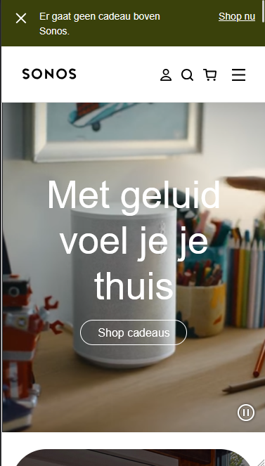

  #### Screenshot(s) van de tweede pagina (small screen):
  Sonos - How sonos works
  https://www.sonos.com/nl-nl/how-sonos-works
  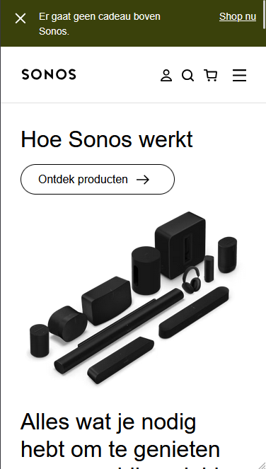
 

## Toegankelijkheidstest 1/2 (week 1)

  
uitwerken na test in 2e werkgroep

#### Niet goed Narrator
Gelijk zag ik al een foutje namelijk op veel `<a>` links ontbreekt een `aria-label`.  
dit zorgt ervoor dat de narrator alleen de zichtbare linkstekst opleest, wat nu dus: **"Shop cadeaus"** is.  
De gebruiker weet dan niet wat voor cadeaus bedoeld worden of waar de link precies naartoe leidt.  
Dit komt bij bijna alle `<a>` elementen voor sommige zijn natuurlijk wel vanzelfsprekend, maar sommige zijn nog wel echt duidelijk en kunnen extra informatie vereisen.

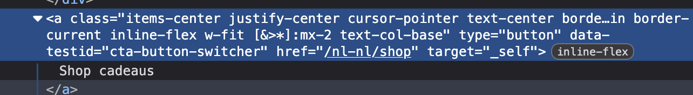

Links in de navbar bevatten ook geen extra context of aria-labels.  
Dit kan ervoor zorgen dat narrators minder kan helpen  duidelijk te maken dat het bijvoorbeeld om onderdelen van de website gaat, zoals *Producten*, *Support* of *Account*.

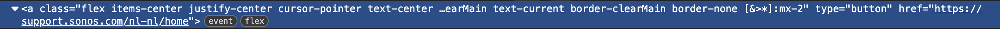

Op de pagina staan **meerdere `<h1>` koppen**, wat verwarrend kan zijn voor de gebruikers die met sneltoetsen door de koppen navigeren 
Een normale structuur van koppen is (`h1` EENMAAL, `h2`, `h3`). 

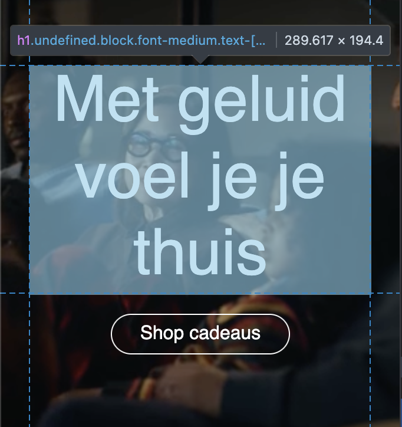

Verder worden sommige  **`buttons`**, met iconen (zoals het winkelmandje en het zoekicoontje) niet duidelijk beschreven worden, of ik dat echt gewoon niet kan vinden...  
Narrator leest b.v.d alleen **`button`** voor zonder verdere uitleg.  
Een korte aria-label zoals `aria-label="zoeken"` of `aria-label="winkelwagentje"` zou dit al meteen duidelijker maken

Sommige sections bevatten grote afbeeldingen en videos zonder alternatieve tekst (`alt`).  
hierdoor mist de gebruiker met een screenreader belangrijke context over wat ermee wordt bedoeld.

#### Wel goed Narrator
De links die wel een `aria-label` bevatten, waren vrij kort en informatief, waardoor je meteen begrijpt waar je naartoe gaat  
De TAB op de site werkt over het algemeen goed je kunt logisch van boven naar beneden door de focus elementen navigeren. 

### Bevindingen
Lijst met bevindingen die in de test naar voren kwamen:

- Website gebruikt **lastige taal**.
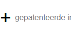

- **HTML-validatie** op W3C Validation Checker levert veel ERRORS op.  
- **Meerdere `<h1>`-elementen** op EEN pagina.  
- Niet alle **afbeeldingen hebben een `alt` attribvute**.  
- Afbeeldingen die **tekst bevatten** hebben geen alt-tekst met de inhoud die op de afbeelding staat.  
- Ze gebruiken `<a>` voor **buttons i.p.v. `<button>` elementen**.  
- **Links** openen niet in een nieuwe tab, wat voor sommige gebruikers verwarrend kan zijn.  
- Veel links missen een **`aria-label`**, waardoor context ontbreekt voor screen readers.  
- Icons (zoals winkelmandje en search) hebben **geen alt of tekst**.  
- **tab** en **focus** werken goed.  
- Waar `aria-labels` wel gebruikt zijn, zijn ze **kort en duidelijk**, echter is er wel veel verbetering nodig bij de rest...

### Dus wat ga ik doen?
- Ik ga ervoor zorgen dat mijn W3C checker 0 errors heeft of warnings.
- Ik zorg voor maar EEN H1 element met informatieve tekst, i.p.v een onduidelijke titel.
- Ik geef elke IMG element een informatieve ALT indien deze afbeelding decoratief is dan hou ik deze op NULL
- Ik ga alle type=button op alle A elementen weghalen.
- Ik ga ervoor zorgen dat de links in een nieuw tablad openen.
- Ik ga ervoor zorgen dat elke link een informatieve aria-label bevat.
- Ik ga ervoor dat mijn focus, hover & active states allemaal overzichtelijk en duidelijk zijn.
- #### Kort samengevat aangezien er nog echt mega veel veranderd moet worden wil ik dit grotendeels opnieuw doen, ik ben perfectionistisch en hier leer ik het meeste van door telkens alles opnieuw te doen.

## Breakdownschets (week 1)

  
uitwerken na afloop 3e werkgroep

  ### de hele pagina: 
  - Zie hier de gehele breakdown
  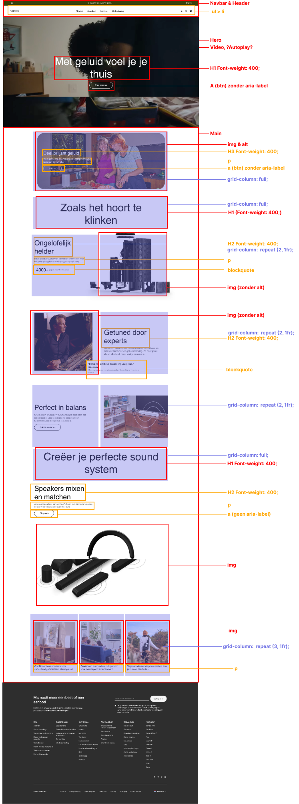

  ### dynamisch deel (bijv menu): 
  - Zie hier een dynamisch deel (Dropdown menu)
  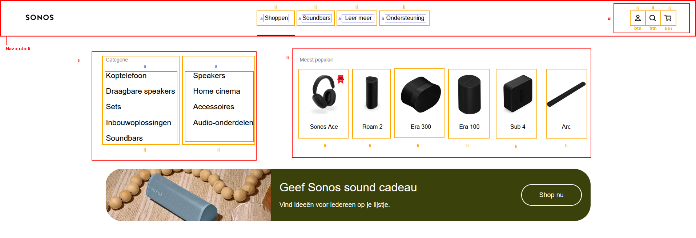

## Voortgang 1 (week 2)

  
uitwerken voor 1e voortgang

  ### Stand van zaken
  hier dit ging goed & dit was lastig (neem ook screenshots op van delen van je website en code)

   #### Dit ging goed:
   - Ik had al erg vlot onder de knie hoe selectors werkte.

  #### Dit ging minder goed:
  - Vaak vergat ik dat ik de hoofd-parent b.v.d main voor mijn selectors moest zetten, zo veranderde er telkens wat in mijn navbar... 
  - Op een gegeven moment werd alles onduidelijk doordat ik niet gebruik maakte van nesting.
  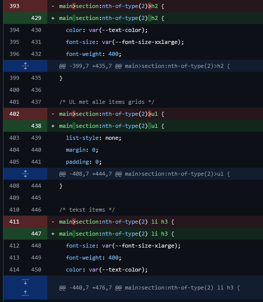

  ### Agenda voor meeting
  samen met je groepje opstellen

  We hebben een teams groepje aangemaakt waarbij we hebben overlegd.
  Zelf heb ik momenteel nog niet echt veel vragen aangezien ik eerder heb gevraagd voor feedback. Echter ga ik wel goed noteren van de feedback van anderen en belangrijke punten van het gesprek schrijf ik.

  | Ronald         |   Daniel           | Iz-Dine.     | Mo.              |
  | ---            | ---                | ---          | ---              |
  | dit bespreken  | en dit             | en ik dit    | Ziek.            |
  | en dat ook nog | dit als er tijd is | nog een punt |                  |
  | HTML-Structuur |.                   |.             |.                 |
  | Kleur over-    |
  | background-img |           

  ### Verslag van meeting
  hier na afloop snel de uitkomsten van de meeting vastleggen

  - 1: Gebruik consistent images onder HEADINGS. Dit werd aangekaart en zelf kwam ik erachter dat ik nog her en daar wat imgs boven headings had.
  - 2: Onderzoek container queries
  - 3: Mijn website bleek mijn CSS er goed uit te zien. Echter bleek nogmaals uit feedback van andere dat mijn classes en ids weg moeten in de Hero, Sanne had dit ook al aangekaart. 
  - 4: Ook was er eerder aangekaart dat de figures om mijn image's niet echt van toepassing zijn en gewoon weg kunnen. 
  Conclusie voor mijn website: Een paar final kleine tweaks bij mijn HTML en dan ben ik helemaal up-to-date 
  - ...

  #### Wat heb ik opgepakt tijdens dit gesprek?
  * Gebruik consistent Headings boven de img attributes.
  * Container queries kunnen erg hulpzaam zijn, voor het namaken van de Sonos website.
  * Gebruik geen figures boven img;s tenzij er een caption echt iets over een img zegt.
  * Gebruik consistent de W3C Validator, om te kijken of er errors zijn of nog e.v.t tips.
  * Maak een aparte CSS bestand aan voor de 2e pagina
  * Maak des noods een globale stylesheet aan waarbij elementen overeen komen op beide pagina;s 
  * H1 verstoppen 

  #### Wat moet ik nu verbeteren?
  * Ik moet nu de figures om mijn images weghalen
  * h1 die er nu staat weghalen, en een nieuwe toevoegen en verstoppen buiten de main 
- #### Ik ga wederom mijn gehele code doorpluimen en grotendeels alles opnieuw schrijven.

## Voortgang 2 (week 3)

  
uitwerken voor 2e voortgang

### Stand van zaken
  hier dit ging goed & dit was lastig (neem ook screenshots op van delen van je website en code)
#### Dit ging goed:
* Het aanmaken van de footer, ging vrij soepel, en ik ben zelf ook best tevreden met het eindresultaat, het enige dat ik nog wil doen is het nog meer responsive te maken b.v.d dat het steeds in rijen naast elkaar gaat momenteel gaat het van 1 rij meteen naar 4 maar ik wil van 1 naar 2 naar 3 naar 4 naar uiteindelijk 5.
* Navigation in de Navbar ben ik ook blij mee, ik heb hier ook een leuke animatie bij toegevoegd doormiddel van transform en transition, ik heb 2 spans gepakt deze heb ik een border gegeven en ge-rotate, en dat zorgt voor een mooie overgang.

#### Dit ging wat minder:
* Grid layouts, ik ben persoonlijk nog niet helemaal tevreden over hoe mijn html structuur overgaat naar grid-layouts, ik ben zelf al perfectionistisch dus als iets me niet zint blijf ik het maar zien en kan ik het niet laten gaan. Echter heb ik tot heden hiervoor nog geen oplossing voor gevonden. Ik heb hierdoor ook echt meerdere keren mijn GEHELE main opnieuw geschreven.
 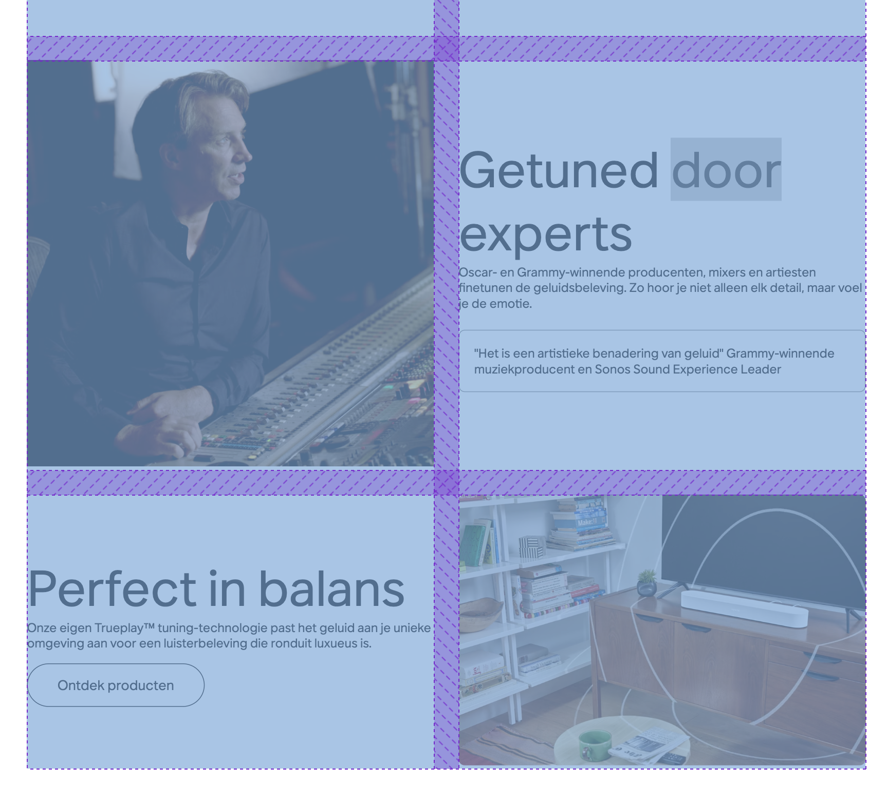

  ### Agenda voor meeting
  samen met je groepje opstellen

Ik heb even snel de structuur veranderd zodat alles wat gemakkelijker te typen is:

- Ronald:
* Is het gebruik van comments duidelijk en overzichtelijk?
* Is het gebruik tekst van bepaalde afbeeldingen duidelijk genoeg?
* Schaling foto oplossen
- Daniel:
* Vraag over navbar en styling over hoe de :root moet worden ingedeeld
- Iz-Dine: 
* Nieuwe pagina layout vragen.

- Ik zelf: 
* Nieuwe pagina, grid-layout hoe kan ik dit het beste aanpakken? Zodat ik niet terugval naar de oude, waarmee ik niet tevreden ben.

  ### Verslag van meeting
  hier na afloop snel de uitkomsten van de meeting vastleggen

  - Label moet altijd een ID hebben als je een "for" gebruikt.
  - List-style-type: ""; als je dit doet i.p.v list-style:none; is het beter voor de screenreader.
  - nog een punt
  - Grid-template-areas kun je een grid-pre definen dormiddel van tekst. Hartstikke handig voor de home-pagina. (Je kunt een grid area leeg laten door een puntje > .)
  - Begin in CSS met generieke dingen en bouw langzaam naar beneden naar specifieke dus Header | Header li | header li a | etc...
  - Hero main
  - Maak gebruik van de search tag
  - Ik  heb dus geleerd hoe ik mijn home-pagina content het beste kan indelen, kwa grid-layout.
- #### Zoals je hierboven zag bij "IK zelf" vroeg ik hoe ik de grid-layout het beste kon aanpakken, ik kreeg gelijk iets nieuws te zien, waardoor mijn oude code alweer "outdated" was en ik wederom grotendeels alles opnieuw ben gaan schrijven.

## Toegankelijkheidstest 2/2 (week 4)

  
uitwerken na test in 9e werkgroep

  ### Bevindingen
  Lijst met je bevindingen die in de test naar voren kwamen (geef ook aan wat er verbeterd is):

  Bij de 2e test is er al veel vooruitgang te zien zo is er veel verbeterd kwa toegangkelijkheid,
  ### WCAG formulier screenshots van elke pagina

#### Pagina 1
* Hierbij op de echte Sonos website, was er spraken van inconsistentie, er werd soms makkelijke taal gebruik en soms totaal niet, hetzelfde geldt voor de bestaande aria-labels, alts etc.
* Ook op de echte Sonos website, miste sommige a attributes een aria-label en sommige buttons ook... Zelfs afbeeldingen miste af en toe een alt, dit heb ik aangepakt en ervoor gezorgd dat alles op mijn pagina 100% zeker een alt, aria-label etc heeft.
* Op de officiele Sonos website kwamen verschrikkelijk veel errors terug uit de W3C validator, zelf heb ik er op mijn website 0.
  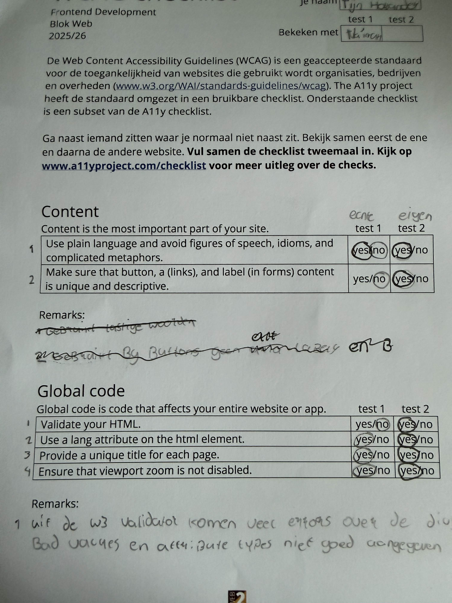

#### Pagina 2
* De focus state op de officiele sonos website is niet echt bepaald geschikt voor iemand met een visuele beperking, zo als je over sommige elementen heen tabt is de border veelste te klein en amper te zien. Ook matcht het niet echt de layout van de sonos website.
* In de footer van de sonos website staan alle a attributen veelste dicht op elkaar dit is niet echt praktisch als je op telefoon zit en wilt navigeren, je hebt dan de kans om op een andere link te klikken...
  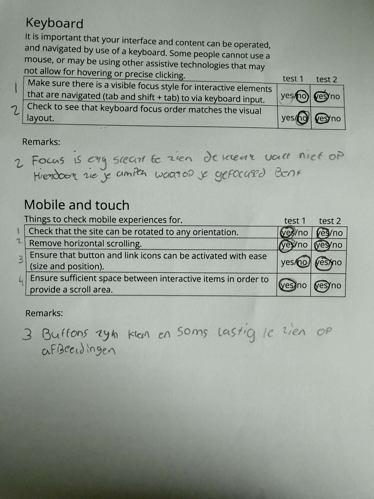

#### Pagina 3
* De headings zijn inconsistent, en kloppen niet de H1 op de officiele website van Sonos geeft ook niet veel informatie waarover de website gaat, er worden ook meerdere H1 elementen gebruikt, en de volgorde klopt ook niet...
* Niet alle image elementen bevatten een alt-attribute
* Sommige images die tekst bevatten bevat de image niet deze tekst in de alt, echter is deze afbeelding nu weg doordat de website naar een kerst thema is gegaan
  

#### Pagina 4
* Op de officiele website van Sonos wordt het A element vaak gebruikt voor links echter heeft deze wel soms een type=button, dit brengt ook vaak errors op in de W3C validator en staat niet zo netjes...
* Links openen niet in een nieuwe tab op de officiele sonos website.
  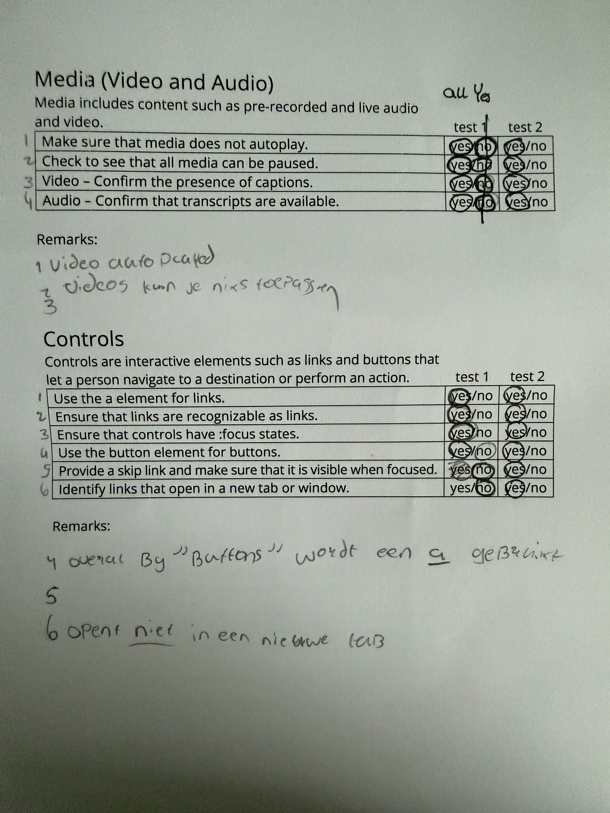

#### Pagina 5
* De officiele Sonos website ondersteund GEEN light & dark mode
* DSe officiele Sonos website HIGH-CONTRAST mode is best wel onduidelijk... Ik had het aangezet en ik snapte er helemaal niks van er stond in mijn navbar dat ik op 3 pagina's tegelijk was doordat de active state op 3 verschillende links stond.
* Wanneer ik mijn animaties uit had gezet op windows, bleef de video op de sonos website nog spelen, en ook bleef er een animatie video spelen onderin.
* De teksten op de officiele website van Sonos die boven een afbeelding stonden vond ik erg onduidelijk er ontbrak een background filter voor mijn gevoel wat de achtergrond iets donkerder maakt zodat alles fijner en aangenamer is om te lezen.
* Ik heb ook geen custom selection colors kunnen vinden op de officiele website.

  

## Voortgang 3 (week 4)

  
uitwerken voor 3e voortgang

  ### Stand van zaken
  * Dit ging goed
  - Voorheen had ik allemaal errors in mijn W3C Validator, ik heb dit allemaal vlot en vlug aangepast naar goeie en nette HTML.
 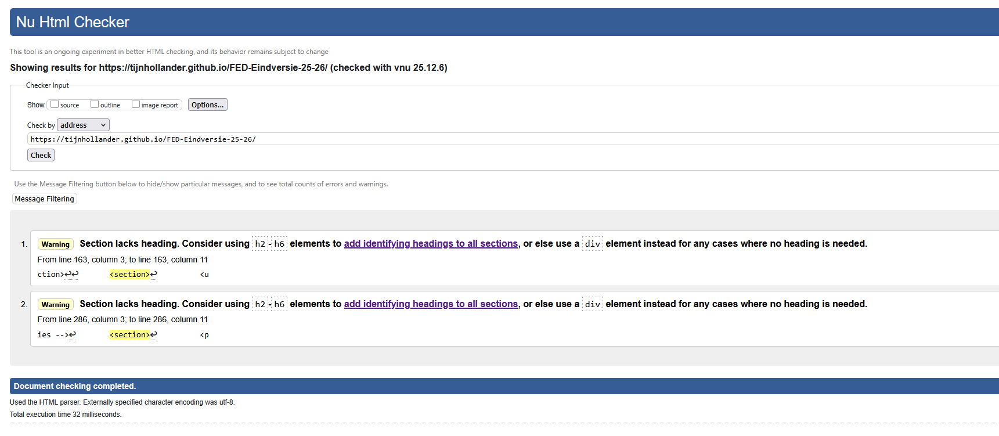

  - Het werken met de nieuwe grid-breakout dat Sanne met liet zien, dit was echt mega handig en super leerzaam en wilde ik ook gelijk opnieuw beginnen hierdoor wat ik wederom ook heb gedaan 
  
  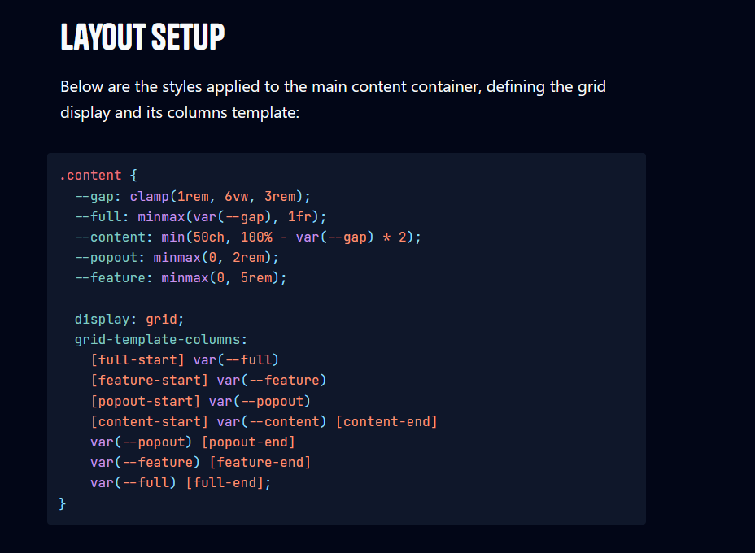
  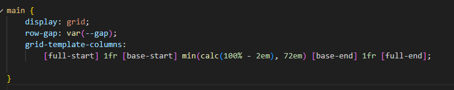

  * Dit ging minder goed
  - De hoeveelheden ik opnieuw ben begonnen, echter heb ik hier wel veel van geleerd. Zo had ik binnen 2-3 uur bijna weer een gehele website, met nesting gemaakt
  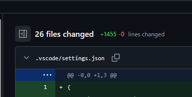

  - Contrast instellingen vinden, ik vond het nog erg lastig om deze te vinden, ook wist ik niet echt hoe ik dit moest toepassen. Moest dit met een media query? of gebeurd dit automatisch? Dus had ik even snel de docent gevraagd voor wat extra hulp hierover. 

  ### Agenda voor meeting
  samen met je groepje opstellen

- Ikzelf:
* Ik wil vragen over als alles aan de eisen voldoet, ik heb zojuist mijn repository voor de 5e keer helemaal omgegooid, dus kan er natuurlijk zomaar iets over het hoofd gelaten worden, dit wil ik dan z.s.m aanpakken.

- Ronald:
* Er zit padding aan de randen van de website na een schermgrootte van 1250px, hoe kan ik deze ook aanhouden responsive want ik gebruik nu een standaard rem
* In de looking for godot text zitten links, als je het zinnetje standaard leest is er genoeg context voor de gebruiker om te snappen waar alles voor is. Maar als ze door de links tabben hebben ze mogelijk te weinig context, is het wijs om hier visually hidden text neer te zetten? Want als ze het hele zinnetje horen klinkt het heel raar
* Werkt mijn skiplink goed op deze manier, zo niet hoe kan ik deze kan verbeteren?
* Staan de links in mijn footer zo genoeg uit elkaar?
* Is de manier hoe ik mijn footer heb gemaakt goed?

- Daniel:
* vragen over responsiveness
- Iz-Dine: 
* Vragen over de gehele website, aangezien alles is missgegaan.

  ### Verslag van meeting
  hier na afloop snel de uitkomsten van de meeting vastleggen

  - Schrijf goed op wat je leuk vind voor het eindgesprek. Code ziet er goed uit, en voldoet aan alle eisen. Tip: WCAG formulier foto's in de readme zetten en zo te laten tonen hoe sonos website toegangelijkheid is verbeterd
  - Nesting is vet handig om overzicht te behouden over je code, gelukkig had ik dit echter al grotendeels gebruikt.
  - Meer padding en minere column-gap bij sommige elementen gebruiken, spacing lijkt soms akward als je dit te erg forceerd.
  - Footer elementen meer uit elkaar zetten op mobile anders wordt het lastig om op sommige elementen te klikken

  ### Wat moet ik nog aanpassen?
  - Padding en witregels bij bepaalde teksten en elementen toevoegen zodat alles consistent is.
  - Footer elementen meer uit elkaar op first-mobile-design
  - Procesverslag bijwerken.

## Eindgesprek (week 5)

  
uitwerken voor eindgesprek

  ### Je uitkomst - karakteristiek screenshots:
  

  ### Dit ging goed/Heb ik geleerd: 
 - Ik heb mijn footer meer spacing gegeven dit was vrij vlot gedaan:
 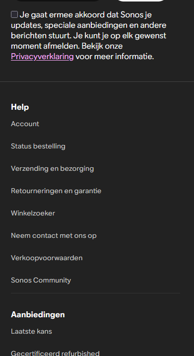

 - Het gebruiken van grid breakout en het toepassen daarvan was ideaal, en mega interessant hierdoor is mijn gehele website super smooth en responsive.
 - Ik heb geleerd om mijn eigen style-guide soortvan te maken doormiddel van :root.
 - Ik heb geleerd hoe een dark & light-mode functionaliteit werkt, met alleen CSS.
 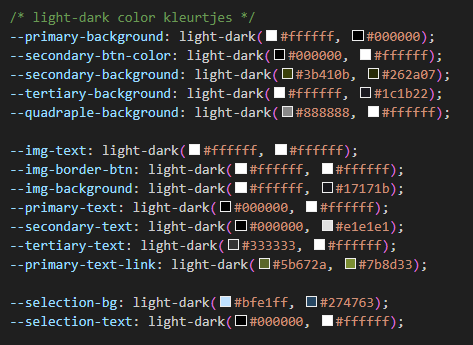

 - Ik heb geleerd hoe ik met behulp van grid-template-area "lastige" layouts heel simpel kan indelen.
  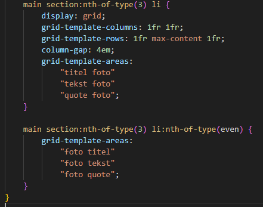

 - Ik heb geleerd hoe ik moet werken met een screenreader (op Mac), en het belang van een screenreader, en hoe je dit kunt toepassen op je eigen website.

 - Ik heb geleerd hoe je states duidelijk en overzichtelijk kunt tonen/weergeven.
 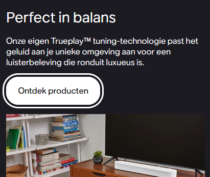

 - Ik heb geleerd hoe ik alles super responsive kan maken.
 - Ik heb geleerd hoe ik alles super goed naar elkaar kan laten overlopen.

 - En ik heb echt nog veel meer geleerd maar ik heb voor mijn gevoel momenteel de super belangrijkste bevindingen opgeschreven.

  

  ### Dit was lastig/Is niet gelukt:
  Korte omschrijving met plaatjes
  - Het was erg lastig om telkens opnieuw te beginnen, het was telkens wel een klap maar gelukkig doordat ik perfectionisch was viel het ook wel weer mee ik wilden het elke keer beter doen dan de vorige, en hier leer je ook natuurlijk het meeste van.
  - Helaas ben ik niet toegekomen om de scroll-driven animations toe te voegen aan mijn sonos-website (Ik heb deze echter wel in een andere repo aangemaakt en getest), ik wil dit echter nog wel gaan oppakken in mijn vrije tijd aangezien ik dit mega leuk vond om te doen.
  -

## Bronnenlijst

  
continu bijhouden terwijl je werkt

  Nb. Wees specifiek ('css-tricks' als bron is bijv. niet specifiek genoeg). 
  Nb. ChatGpT en andere AI horen er ook bij.
  Nb. Vermeld de bronnen ook in je code.

  1. bron 1 MP3 sonos (Background video): https://youtu.be/DwIdo-4jwNk
  2. bron 2  Nav (Om een basis nav-bar snel neer te zetten): https://www.w3schools.com/howto/howto_js_mobile_navbar.asp
  3. bron 3 FlexBox: https://css-tricks.com/snippets/css/a-guide-to-flexbox/
  4. Bron 4: Child delay animations: https://stackoverflow.com/questions/8294400/css-animations-with-delay-for-each-child-element
  5. Bron 5: Scroll-driven-animations (Ik heb dit echter voor nu weggelaten): https://youtu.be/gYwmiZ0Mza8
  6. Bron 6: Pause button (Om de background-video te stoppen) https://yootheme.com/support/question/165803
  7. Bron 7: Alle Content en images zijn eigendom van: https://www.sonos.com/nl-nl/home
  8. Bron 8: Layout-breakouts: https://ryanmulligan.dev/blog/layout-breakouts/ 
  9. bron 9: Sanne (Shooft) voor veel hulp kwa grid-layout structuur en veel meer: https://codepen.io/shooft
  10. Bron 10: A11y project, voor veel accessbility CSS helpers, ik wist namelijk zelf niet hoe ik dit het beste neer kon zetten door de vorobeelden van A11y project is dit me gelukt: https://www.a11yproject.com/
  11. Bron 11: Light en darkmode toepassen in CSS (Snelle preset heb ik gekopieerd en aangepast naar mijn eigen): https://developer.mozilla.org/en-US/docs/Web/CSS/Reference/At-rules/@media/prefers-color-scheme
  12. Bron 12: GitHub Co-pilot, voor bugs die ik echt niet kon vinden vaak waren dit kleuren of variablen in mijn root waar een ";" was vergeten, en ik niet begreep waarom mijn variable niet werkte/aangeroepen werd.

